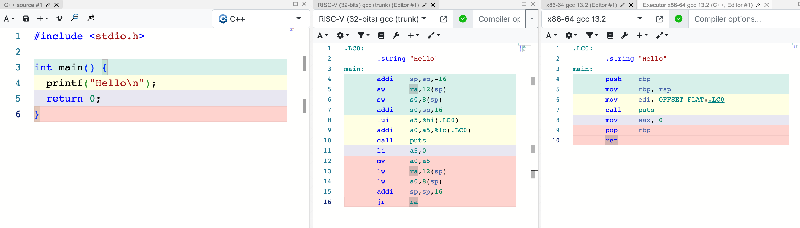
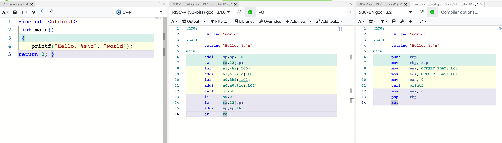

### C code for counter and matrix multiplication. And comparing hello program from the rvbook
**shcmds** show the comands to complie and execute each program using the risc-v toolchain compiler

Using **spike** as a RISC-V ISA simulator  https://github.com/riscv-software-src/riscv-isa-sim

On a MacOS with a apple M2 cpu I have used  https://github.com/riscv-software-src/homebrew-riscv to set up the RISC-V toolchain which includes Spike

-- compile to risc-v
```
riscv64-unknown-elf-gcc -o hello hello.c
riscv64-unknown-elf-gcc -o hello_rvbook hello_rvbook.c
riscv64-unknown-elf-gcc -o count count.c
riscv64-unknown-elf-gcc -o matmulti matmulti.c
```
-- compile to assembly format
```
riscv64-unknown-elf-gcc -S hello.c
riscv64-unknown-elf-gcc -S hello_rvbook.c
```
-- execute using spike
```
spike pk hello
spike pk count
spike pk matmulti
```
Since I have a https://milkv.io/duo, the programs are also tested on actual risc-v hardware  

Using https://godbolt.org/ to show RISC-V assemble and execution:
1. Hello: https://godbolt.org/z/zore9ffKW
2. Hello_rvbook: https://godbolt.org/z/Md5frnW1j
3. Count: https://godbolt.org/z/efvE7njTv
4. MatMuli: https://godbolt.org/z/9rfE4d1eW

### Assembly differences

Showing the assembly code differences between a very basic C hello program and the C hello program from the rvbook. Assemby for godbolt RISC-V gcc, godbolt x86-64 gcc and the riscv64-unknown-elf-gcc toolchain.

#### Godbolt Hello


##### From the risc-v gcc toolchain
``` assembly
	.file	"hello.c"
	.option nopic
	.attribute arch, "rv64i2p1_m2p0_a2p1_f2p2_d2p2_c2p0_zicsr2p0"
	.attribute unaligned_access, 0
	.attribute stack_align, 16
	.text
	.section	.rodata
	.align	3
.LC0:
	.string	"Hello"
	.text
	.align	1
	.globl	main
	.type	main, @function
main:
	addi	sp,sp,-16
	sd	ra,8(sp)
	sd	s0,0(sp)
	addi	s0,sp,16
	lui	a5,%hi(.LC0)
	addi	a0,a5,%lo(.LC0)
	call	puts
	li	a5,0
	mv	a0,a5
	ld	ra,8(sp)
	ld	s0,0(sp)
	addi	sp,sp,16
	jr	ra
	.size	main, .-main
	.ident	"GCC: (gc891d8dc2-dirty) 13.2.0"
```

#### Godbolt Hello_rvbook


##### From the risc-v gcc toolchain
``` assembly
	.file	"hello_rvbook.c"
	.option nopic
	.attribute arch, "rv64i2p1_m2p0_a2p1_f2p2_d2p2_c2p0_zicsr2p0"
	.attribute unaligned_access, 0
	.attribute stack_align, 16
	.text
	.section	.rodata
	.align	3
.LC0:
	.string	"world"
	.align	3
.LC1:
	.string	"Hello, %s\n"
	.text
	.align	1
	.globl	main
	.type	main, @function
main:
	addi	sp,sp,-16
	sd	ra,8(sp)
	sd	s0,0(sp)
	addi	s0,sp,16
	lui	a5,%hi(.LC0)
	addi	a1,a5,%lo(.LC0)
	lui	a5,%hi(.LC1)
	addi	a0,a5,%lo(.LC1)
	call	printf
	li	a5,0
	mv	a0,a5
	ld	ra,8(sp)
	ld	s0,0(sp)
	addi	sp,sp,16
	jr	ra
	.size	main, .-main
	.ident	"GCC: (gc891d8dc2-dirty) 13.2.0"
```

##### From the rvbook
``` assembly
  .text
  .align 2
  .globl main
main:
  addi sp,sp,-16
  sw   ra,12(sp)
  lui  a0,%hi(string1)
  addi a0,a0,%lo(string1)
  lui  a1,%hi(string2)
  addi a1,a1,%lo(string2)
  call printf
  lw   ra,12(sp)
  addi sp,sp,16
  li   a0,0
  ret
  .section .rodata
  .balign 4
string1:
  .string "Hello, %s!\n"
string2:
  .string "world"
```
