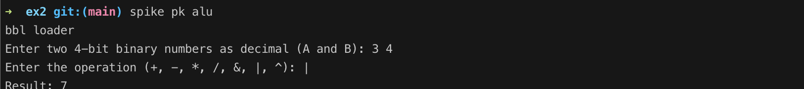
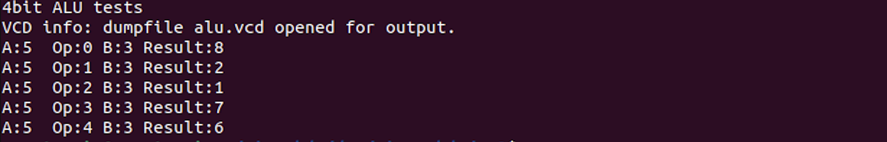
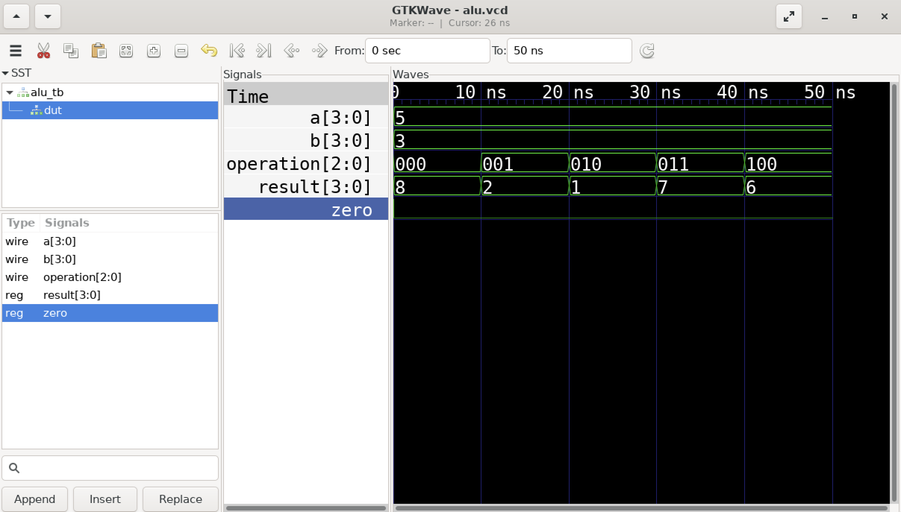
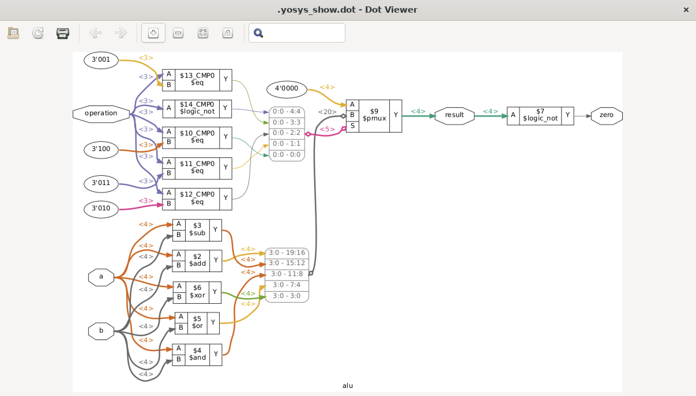

### Calculate - 10-19 base 10 using signed and using 1s and 2s complement.

```
10-19 = -9
```

```
10 = 00001010
19 = 00010011
```

```
1s complement of 19 = 11101100
2s complement of 19 = 11101101
```

```
10 + (-19) = 00001010 + 11101101 = 11110111
```

```
1s complement of 11110111 = 00001000
2s complement of 11110111 = 00001001
```

```
-9 = 00001001
```

```
10-19 = 10 + (-19) = 10 + 1s complement of 19 + 1 = 10 + 11101100 + 1 = 10 + 11101101 = 11110111
```

### C based 4bit ALU
-- compile to risc-v
```
riscv64-unknown-elf-gcc -o alu alu.c
```
-- execute using spike
```
spike pk alu
```
-- command line C program run


### Verilog 4bit ALU
-- compiler verilog with test bench

Note that the alu_tb.v test bench sets up the test operations and defines the name of the .vcd file for gtkwave
```
iverilog -o alu_v alu_tb.v alu.v
```
-- execute verilog
```
vvp alu_v
```


-- display gtkwave for ALU
```
gtkwave.vcd
```


-- RTL systhesis showing fpga gates
```
yosys -p "read_verilog alu.v; proc; opt; show -colors 2 -width -signed"
```

