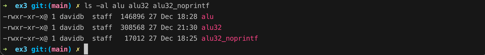

### C code RISC-V verification

-- compile to 64bit risc-v
```
riscv64-unknown-elf-gcc -o count count.c
riscv64-unknown-elf-gcc -o matmulti matmulti.c
riscv64-unknown-elf-gcc -o alu alu.c
```
### 32bit RISC-V compilation

-- compile to 32bit risc-v with libs
```
riscv64-unknown-elf-gcc -march=rv32i -mabi=ilp32 -ffreestanding -o count32 count.c
riscv64-unknown-elf-gcc -march=rv32i -mabi=ilp32 -ffreestanding -o matmulti32 matmulti.c
riscv64-unknown-elf-gcc -march=rv32i -mabi=ilp32 -ffreestanding -o alu32 alu.c
```

-- compile to 32bit risc-v without #includes,libraries and printf
```
riscv64-unknown-elf-gcc -march=rv32i -mabi=ilp32 -ffreestanding -o count32_noprintf count32_noprintf.c
riscv64-unknown-elf-gcc -march=rv32i -mabi=ilp32 -ffreestanding -o matmulti32_noprintf matmulti32_noprintf.c
riscv64-unknown-elf-gcc -march=rv32i -mabi=ilp32 -ffreestanding -o alu32_noprintf alu32_noprintf.c
```

-- dump to assembly format without #includes,libraries and printf
```
riscv64-unknown-elf-objdump -d -r count32_noprintf > count32_noprintf.txt
riscv64-unknown-elf-objdump -d -r matmulti32_noprintf > matmulti32_noprintf.txt
riscv64-unknown-elf-objdump -d -r alu32_noprintf > alu32_noprintf.txt
```

-- execute count using spike


-- execute matmulti using spike


-- execute alu using spike


### Comparing 64bit to 32bit sizes, and 32bit without libs

The same c code for 32bit compliles down to double the size to that of 64bit. Whilst a 32bit lib stripped c code is about 7% of 32bit compliled executable.  

-- count


-- matmulti


-- alu


### RISCV-C CPU Performance

-- count32 lib stripped assembly
```
riscv64-unknown-elf-gcc -march=rv32i -mabi=ilp32 -ffreestanding -S count32_noprintf.c
```

``` assembly
        .file   "count32_noprintf.c"
        .option nopic
        .attribute arch, "rv32i2p1"
        .attribute unaligned_access, 0
        .attribute stack_align, 16
        .text
        .align  2
        .globl  display
        .type   display, @function
display:
        addi    sp,sp,-32
        sw      s0,28(sp)
        addi    s0,sp,32
        sw      a0,-20(s0)
        nop
        lw      s0,28(sp)
        addi    sp,sp,32
        jr      ra
        .size   display, .-display
        .align  2
        .globl  main
        .type   main, @function
main:
        addi    sp,sp,-32
        sw      ra,28(sp)
        sw      s0,24(sp)
        addi    s0,sp,32
        sw      zero,-20(s0)
.L4:
        lw      a0,-20(s0)
        call    display
        lw      a5,-20(s0)
        addi    a5,a5,1
        sw      a5,-20(s0)
        lw      a4,-20(s0)
        li      a5,16
        bne     a4,a5,.L4
        sw      zero,-20(s0)
        j       .L4
        .size   main, .-main
        .ident  "GCC: (gc891d8dc2-dirty) 13.2.0"
``` 

**Display** = 8 instructions

**Loop .L4** = 10 instuctions

**Main** = 5 instructions

One pass of the count loop = 4 (main) + 10 (loop) + 8 (display) = 22 instructions

RISC-V CPU's do one instruction per clock cycle, hence one pass of `count32_noprintf.c` = 22 clock cycles

If the CPU was 10Mhz then one count loop would take 2.2 microseconds if no libraries were called, but since display is non functional the count program could be optimised by removing 8 (display) cpu cycles and 1 cpu cycle from the call to display from .L4, this would make the optimised count program taking 13 cpu cycles or 1.3 microseconds.

