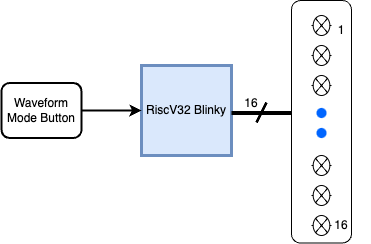
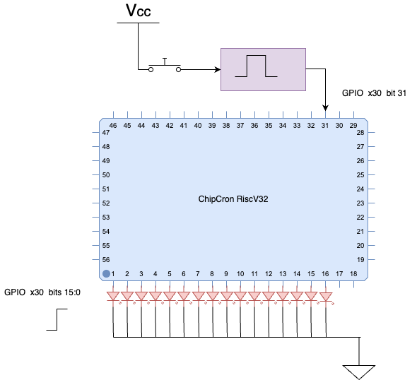
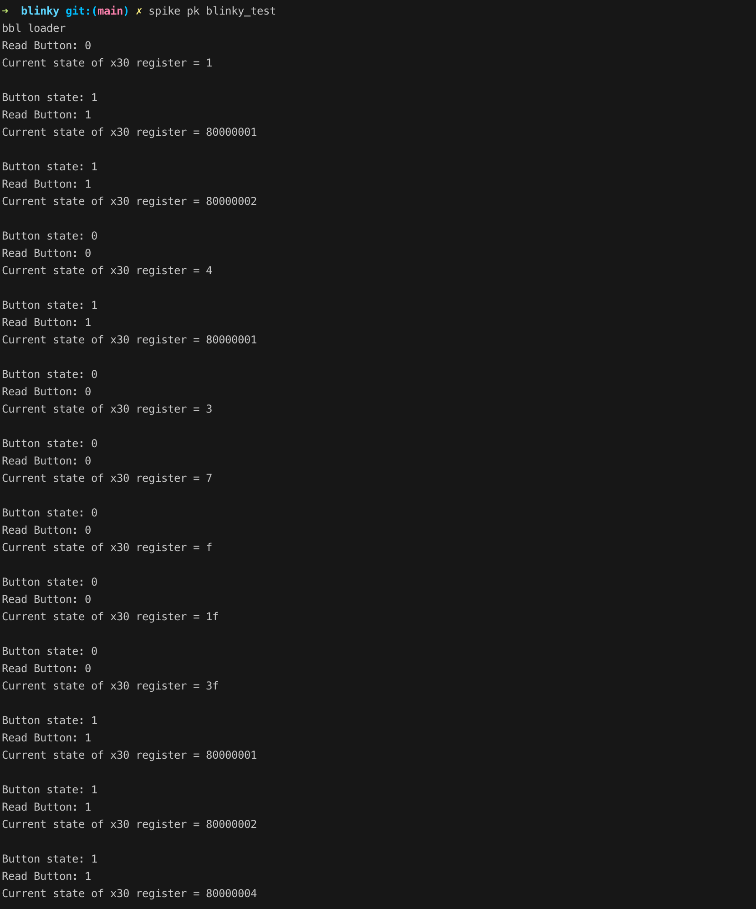

### Blinky IOT
Display a pattern on 16 leds. The pattern changes when the display waveform button is pressed.

#### Block Diagram


#### Blinky Schematic


#### x30 GPIO allocation
Output:

x30[15:0] - 16 display leds: active high

Input:

x30[31] - toggle mode button: pulse length 100ms

#### C code
1. blinky_test.c - app for testing the GPIO x30 registor
1. blinky.c - stripped for verilog generation

-- blinky test
``` C
#include <stdio.h>
#include <stdlib.h>

// GPIO bits
const int ON = 1;
const int OFF = 0;
const int LED_MASK = 0xFFFF; // Mask for LED bits (x30[15:0])
// Test: set button state (x30[31])
const int BUTTON_ON = 0x80000000;  // x30[31] =1
const int BUTTON_OFF = 0x00000000; // x30[31] =0

// Function prototypes
void setLEDs(int led_pattern);
int readButton();
// test: set button state
void setButton(int GPIO_button_bit);

int main() {
  int button_state = 0;
  int previous_button_state = 0;
  int current_pattern = 0;     // Start with pattern 0
  int current_pattern_set = 0; // Start with pattern set 0
  int i;                       // Loop counter
  int seconds = 1;             // Delay time
  // test
  int x30_value = 0x00000000;
  int set_button_state = 0;

  int patterns_set1[] = {0x0001, 0x0003, 0x0007, 0x000F,
                         0x001F, 0x003F, 0x007F, 0x00FF};
  int patterns_set2[] = {0x0001, 0x0002, 0x0004, 0x0008,
                         0x0016, 0x0032, 0x007F, 0x00FF};
  int *current_patterns = patterns_set1; // Start with patterns_set1

  while (1) {
    button_state = readButton();
    // Test: Read the current value of x30 register (button state)
    printf("Read Button: %d\n", button_state);

    // Check for low-to-high transition
    if (button_state == ON && previous_button_state == OFF) {
      // Button pressed, change pattern set
      current_pattern_set =
          (current_pattern_set + 1) % 2; // Toggle between 0 and 1
      current_patterns =
          (current_pattern_set == 0) ? patterns_set1 : patterns_set2;
      current_pattern = 0; // Reset pattern index within the set
    }

    previous_button_state = button_state;

    setLEDs(current_patterns[current_pattern]);
    // Test: Read the current value of x30 register (LED pattern)
    asm volatile("addi %0, x30, 0\n\t" : "=r"(x30_value) : :); // read x30
    printf("Current state of x30 register = %x\n\n", x30_value);

    current_pattern = (current_pattern + 1) %
                      (sizeof(current_patterns)); // Advance pattern index

    // Delay to control pattern speed
    for (i = 0; i < seconds * 1000000; i++) {
      asm volatile("nop");
    }

    // Test: Randomly set the button state (x30[31])
    set_button_state = random() % 2;
    printf("Button state: %d\n", set_button_state);
    if (set_button_state == 1) {
      setButton(BUTTON_ON);
    } else {
      setButton(BUTTON_OFF);
    }
  }

  return 0;
}

// Function definitions =====================================================

void setLEDs(int led_pattern) {
  int mask = 0xFFFF0000; // preserve all bits except x30[0] - set to 0
  asm volatile("and x30,x30, %1\n\t"
               "or x30,x30, %0\n\t"
               :
               : "r"(led_pattern), "r"(mask)
               : "x30" // clobber list,indicating that x30 is modified
  );
}

int readButton() {
  int button_press; // read whether it is pressed or not
  asm volatile("srli x10, x30, 31\n\t"
               "andi %0, x10, 1\n\t"
               : "=r"(button_press)
               :
               : "x10");
  return button_press;
}

// Test: Set the button state
void setButton(int GPIO_button_bit) {
  int mask = 0x7FFFFFFF; // preserve all bits except x30[31] - set to 0
  asm volatile("and x30,x30, %1\n\t"
               "or x30,x30, %0\n\t"
               :
               : "r"(GPIO_button_bit), "r"(mask)
               : "x30" // clobber list,indicating that x30 is modified
  );
}

```

#### Instructions used
```
```
#### Testing app via x30 GPIO bits 

