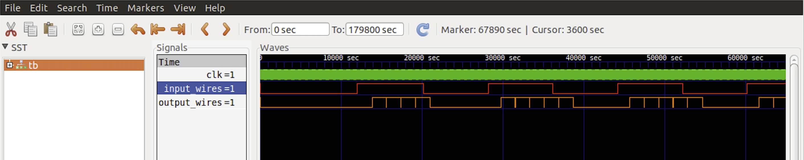
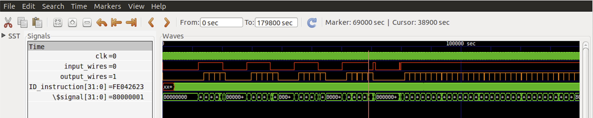

### Doorbell IOT
Very basic doorbell with one button to activate a bell

#### Block Diagram


#### Doorbell Schematic


#### x30 GPIO allocation
Output:

x30[0] - enable buzzer sound: active high

Input:

x30[31] - detect button signal: active high

#### C code
1. doorbell_concept.c - original thinking
1. doorbell_test.c - app for testing the GPIO x30 registor
1. doorbell.c - stripped for verilog generation

``` C
// #include <stdio.h>
// #include <stdlib.h>

// GPIO bits
const int ON = 1;
const int OFF = 0;

// Function prototypes
void setBuzzer(int GPIO_buzz_bit);
int readButton();

int main() {
  int button_state = 0; // Store button state
  int i;                // Loop counter
  int seconds = 1;      // Delay time

  while (1) {
    // Continuously read the button state
    button_state = readButton();

    // If button is pressed, turn on the buzzer
    if (button_state == ON) {
      setBuzzer(ON);
      // printf("Doorbell activated! Buzzer on.\n");
    } else {
      // If button is not pressed, turn off the buzzer
      setBuzzer(OFF);
      // printf("Doorbell deactivated! Buzzer off.\n");
    }

    // Delay to avoid excessive button readings
    for (i = 0; i < seconds * 1000000; i++) {
      asm("nop");
    }
  }

  return 0;
}

// Function definitions =====================================================

void setBuzzer(int GPIO_buzz_bit) {
  int mask = 0xFFFFFFFE; // preserve all bits except x30[0] - set to 0
  asm volatile("and x30,x30, %1\n\t"
               "or x30,x30, %0\n\t"
               :
               : "r"(GPIO_buzz_bit), "r"(mask)
               : "x30" // clobber list,indicating that x30 is modified
  );
}

int readButton() {
  int button_press; // read whether is pressed or not
  asm volatile("srli x10, x30, 31\n\t"
               "andi %0, x10, 1\n\t"
               : "=r"(button_press)
               :
               : "x10");
  return button_press;
}

```

#### Instructions used
```
Total Number of instructions    : 64
Chipcron pc_bit_width config    : 7
Number of different instructions: 16
List of unique instructions:
or
bne
mv
blt
srl
sw
sll
lw
ret
li
j
nop
sub
jal
and
add
```
#### Testing app via x30 GPIO bits


#### Pre-config Verilog generation
Unmodified ChipCron processor.v and testbench.v doing a verilog run. This tests out the doorbell program loading from the uart.
```
iverilog -o doorbell_v testbench.v  processor.v
vvp doorbell_v
```


-- running simulator with -fst flag to compress the .vcd file as the native file waveform can get very large. A smaller .vcd helps gtkwave to load faster.
```
vvp doorbell_v -fst
```

#### GPIO Config
*processor_gpio_doorbell.v* gpio input and output verilog changes where input_gpio_pins is bit 31 of the x30 register and top_gpio_pins[0:0] is bit 0 of the x30 register
```
    input wire input_gpio_pins;
    output reg output_gpio_pins;
...
    output_pins = {input_gpio_pins, 30'b0, top_gpio_pins[0:0]} ;
    output_gpio_pins = top_gpio_pins[0:0];
```
*testbench_gpio_doorbell.v* configured to disable the uart tests. input_wires simulates the button being pressed
```
    input_wires = 1'b0;
    #4000
...
    uart_rx_en = 1'b1;
/*
    comment out the uart load tests
*/
	 #8000
	 input_wires = 1'b1;
	 #8200
	 input_wires = 1'b0;
	 #8000
	 input_wires = 1'b1;
	 #8000
	 input_wires = 1'b0;
	 #8000
	 input_wires = 1'b1;
	 #8000
     	 input_wires = 1'b0;
	 #8000
     	 input_wires = 1'b1;
	 #8000
     	 input_wires = 1'b1;
	 #800
     	 input_wires = 1'b0;
	 #800
     	 input_wires = 1'b0;
	 #800
     	 input_wires = 1'b1;
	 #800
     	 input_wires = 1'b0;
	 #8000
     	 input_wires = 1'b1;
	 #200
     	 input_wires = 1'b0;
	 #200
     	 input_wires = 1'b1;
```
### GTKWave simulations
#### Simulation with long timing delay code enabled
The delay does 1000000 for loop cycles which is too long to see input/output changes.
```
gtkwave waveform.vcd
```
Showing the input_wires simulating the button being pressed but the buzzer not being activated until the very long timing delay code has completed.


From device reset to the first instruction *fe010113 add sp,sp,-32*, we can see the x30

#### Simulations with long timing delay code disabled
The delay code has been limited to 2 for loop cycles for these simulations.
```
gtkwave waveform.vcd
```
Just showing the input_wires simulating the button being pressed and the buzzer being activated, the output_wire has brief pulses to 0 while the button is pressed. This is due to the code for function setBuzzer() where the x30 register is ANDed with 0xFFFFFFFE to clear the bit 0 then is ANDed with the GPIO_buzz_bit which is 1 to set the bit 0 to 1 again.


The whole input and output simulation cycle. Also showing input glitching when the button is pressed but still debounce even though the delay code has been limited to 2 for loop cycles.


From device reset to the first instruction *fe010113 add sp,sp,-32*.


Showing debounce input


The setBuzzer() ORing instruction *00ff6f33 or	t5,t5,a5* setting the buzzer output to 1.


Showing when the input goes from high to low the x30 register bit 31 is set to 0 but bit 0 is still set to 1.


The lag from when input_wire goes low to high and the buzzer output goes low to high is due to code processng and the 2 loop delay code.


Input_wire goes high to low then the low-high high-low glitch, we see the x30 register bit 31 changing from 1 to 0 and then back to 1 and 0. The output stays high due to lag in the code and ignores the glitch.

