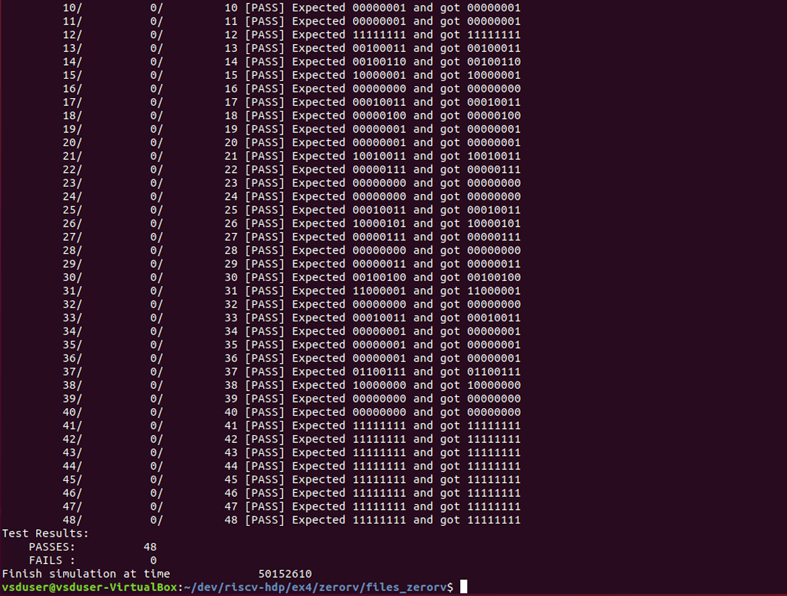

### ZeroRV IOT
The smallest c program footprint. Used only to validate very basic riscv cpu generation, as it has no input or output and the program is the smallest possible for c to generate. Useful to validate verilog simlations as the programs steps are small enough to trace through the waveforms. 

**ZeroRV** with implicit int return
``` C
int main()
{
}
```
Assembly Listing:
``` Assembly
zerorv.o:     file format elf32-littleriscv


Disassembly of section .text:

00010074 <main>:
   10074:	ff010113          	add	sp,sp,-16
   10078:	00812623          	sw	s0,12(sp)
   1007c:	01010413          	add	s0,sp,16
   10080:	00000793          	li	a5,0
   10084:	00078513          	mv	a0,a5
   10088:	00c12403          	lw	s0,12(sp)
   1008c:	01010113          	add	sp,sp,16
   10090:	00008067          	ret
```
**ZeroRv_rtn** with explicit int return
``` C
int main()
{
	return(0);
}
```
Assembly Listing:
``` Assembly
zerorv_rtn.o:     file format elf32-littleriscv


Disassembly of section .text:

00010074 <main>:
   10074:	ff010113          	add	sp,sp,-16
   10078:	00812623          	sw	s0,12(sp)
   1007c:	01010413          	add	s0,sp,16
   10080:	00000793          	li	a5,0
   10084:	00078513          	mv	a0,a5
   10088:	00c12403          	lw	s0,12(sp)
   1008c:	01010113          	add	sp,sp,16
   10090:	00008067          	ret
```

**ZeroRV_void** void return
``` C
void main()
{
}
```
Assembly Listing:
``` Assembly
zerorv_void.o:     file format elf32-littleriscv


Disassembly of section .text:

00010074 <main>:
   10074:	ff010113          	add	sp,sp,-16
   10078:	00812623          	sw	s0,12(sp)
   1007c:	01010413          	add	s0,sp,16
   10080:	00000013          	nop
   10084:	00c12403          	lw	s0,12(sp)
   10088:	01010113          	add	sp,sp,16
   1008c:	00008067          	ret
```
Both ZeroRV and ZeroRv_rtn have 6 instructions, ZeroRV_void has 5 by removing the return.

### NopRV
One riscv nop instruction.  
``` assembly
asm("nop");
```
Assembly listing:
``` Assembly

noprv.o:     file format elf32-littleriscv


Disassembly of section .text:

00010074 <__BSS_END__-0x1004>:
   10074:	00000013          	nop
```

#### Block Diagram


#### ZeroRV Complilation and assembly
```
riscv64-unknown-elf-gcc -mabi=ilp32 -march=rv32i -ffreestanding -nostdlib -o zerorv.o zerorv.c
riscv64-unknown-elf-objdump -d -r zerorv.o > zero_assembly.txt
```

#### NopRV Complilation and assembly
```
riscv64-unknown-elf-gcc -mabi=ilp32 -march=rv32i -ffreestanding -nostdlib -o noprv.o noprv.c
riscv64-unknown-elf-objdump -d -r noprv.o > noprv_assembly.txt
```
### Verilog ZeroRV
-- compiler verilog with test bench

Note that testbench.v sets up the test operations and defines the name of the .vcd file for gtkwave
```
iverilog -o verorv_v testbench.v processor.v
```
-- execute verilog
```
vvp zerorv_v
```



-- display gtkwave for ZeroRV
```
gtkwave.vcd waveform.vcd
```


### Verilog NopRV
-- compiler verilog with test bench

Note that testbench.v sets up the test operations and defines the name of the .vcd file for gtkwave
```
iverilog -o noprv_v testbench.v processor.v
```
-- execute verilog
```
vvp noprv_v
```


-- display gtkwave for NopRV
```
gtkwave.vcd waveform.vcd
```


---
The objective for this exercise is complete. I wont be continuing it further.
